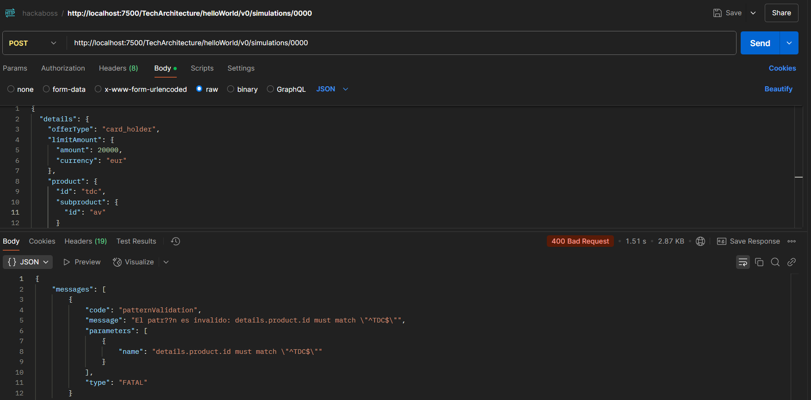
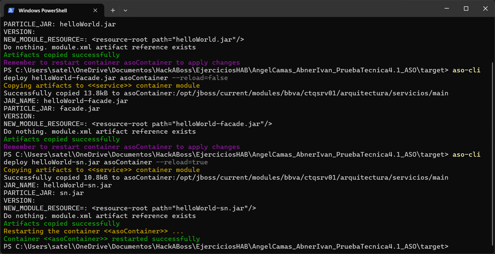

# AngelCamasAbnerIvan_pruebatec4.1_ASO

# 📌 Simulación de Contratación de Tarjetas de Crédito

Este proyecto implementa una API REST en Java para gestionar simulaciones de contratación de tarjetas de crédito en un banco. Se ha desarrollado siguiendo una arquitectura en capas utilizando ** Business y Facade**.

## 📂 Estructura del Proyecto

El código fuente está organizado de la siguiente manera:

- **business.v0**: Contiene la lógica de negocio y los DTOs correspondientes.
- **facade.v0**: Actúa como una capa intermedia para exponer los servicios de negocio.


## 🛠️ Tecnologías Utilizadas

- **Java 1.8**
- **Maven**
- **Docker** (para contenedor)
- **ASO**
- **Postman**  (para pruebas)
- **IntelliJ IDEA Community**

---

## 🚀 Cómo Ejecutar

**Abrir el proyecto en un IDE compatible** como NetBeans o IntelliJ IDEA.  
**Ejecutar el programa** desde Maven 

---

Pruebas Realizadas con ayuda de Postman
URL 

http://localhost:7500/TechArchitecture/helloWorld/v0/simulations/0000

Request del servicio ASO.
El siguiente JSON para el servicio:
```{
  "details": {
    "offerType": "CARD_HOLDER",
    "limitAmount": {
      "amount": 20000,
      "currency": "EUR"
    },
    "product": {
      "id": "TDC",
      "subproduct": {
        "id": "AV"
      }
    }
  }
}```


el caso de prueba exitoso
   no supe como agregar las imagenes ,asi que solo las subí al repositorio


el caso de prueba fallido ,ya que se usó minusculas


y los archivos JAR utilizados


